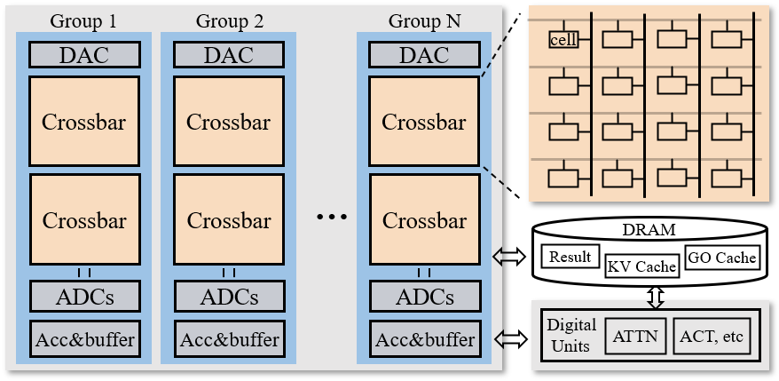

# MoE-PIM

Repository of the paper Area-Efficient In-Memory Computing for
Mixture-of-Experts via Multiplexing and Caching
[](https://github.com/superstarghy/MoEwithPIM)
[]()
[](https://arxiv.org/abs/2602.10254)

<p align="center">
  
</p>


## Get started

### Setup
Clone the repository, step inside it and install.
```bash
cd MoEwithPIM
pip install -e .
```

### Run

Start from [`main.py`](./main.py).
```
python main.py --new_length 8 --kv_flag --go_flag
```

The workflow of threedcim simulator:

```python
import threedsim
# Accelerator configuration
config = threedsim.accelerator.AcceleratorConfig(...)
# Instantiate the Accelerator Object
acc = Accelerator(config, device=device)
# Software model configuration
#!Important: use the modules in threedim
model = threedsim.models.DecoderOnlyTransformer(
    threedsim.modules.TransformerDecoderLayer, ...)
assign_acc(model, acc)
# Mapper, strategy to schedule
mapper = threedsim.mapping.Mapper()
# Run simulation and trace
fast_traced = fast_trace_decoder(model,)
eval_results = threedsim.inference.schedule_execution(
    fast_traced.graph, model.accelerator, ...)
```

To use the dynamic scheduler simulator, first of all, collect any data of expert load statistics (number of tokens an expert recieved) from an MoE model.
For example, the data shape is (#layer, #batch, #expert), including the expert load amount of different batches and layers.

Check [`moe_schedule.py`](./moe_schedule.py) to see the design of the scheduler and different types of dataflow.

```
python moe_schedule.py --gate_load_path load.npy --num_layers 4
```

### Plotting

The threedcim simulator provides tools to plot the execution grapgh. Set the `plot` flag in `schedule_execution` to plot the inference pipeline.

```python
from threedsim.plotting import plot_graph
...
fast_traced = fast_trace_decoder(model, start_len, target_len, num_sequences)
plot_graph(fast_traced, "results/encoder_decoder_fast_tracing.svg")

_ = schedule_execution(...,  plot=True, plot_dir="results")
```

## Reference
```
@misc{gao2026imc_moe,
      title={Area-Efficient In-Memory Computing for Mixture-of-Experts via Multiplexing and Caching}, 
      author={Hanyuan Gao and Xiaoxuan Yang},
      year={2026},
      eprint={2602.10254},
      archivePrefix={arXiv},
      primaryClass={cs.AR},
      url={https://arxiv.org/abs/2602.10254}, 
}
```

## License
Please see the [NOTICE](./NOTICE) and [LICENSE](./LICENSE) file.
